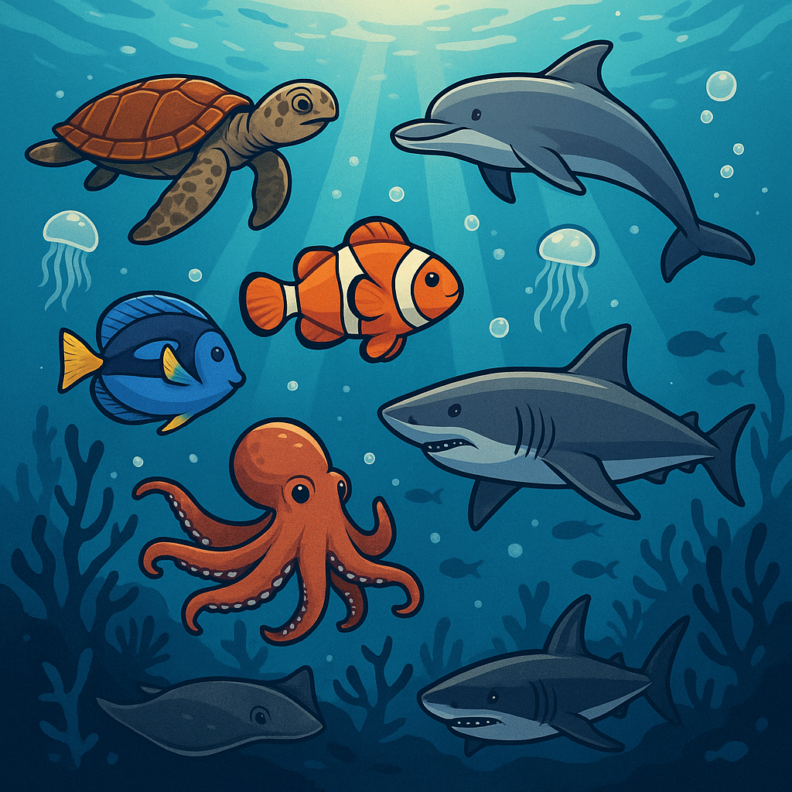

# 🐳 Marine Life Detection  
### A Computer Vision Project Combined With Unsupervised & Transfer Learning | Ironhack Data Science Bootcamp


## 📌 Introduction  
This project focuses on building a deep learning pipeline to classify marine animal images into distinct categories using transfer learning with MobileNetV2. The images are preprocessed and stored as `.pt` tensors, grouped by visual similarity through unsupervised learning. 
The model is trained with data augmentation, early stopping, and validation monitoring, achieving robust performance on unseen test images.

To make the model accessible, a Streamlit app is included for drag-and-drop image classification in real-time. The app accepts `.jpg` or `.png` files and returns the predicted class instantly.

The complete workflow—from data handling and training to evaluation and deployment—is designed to be modular and easy to extend for future datasets or classification tasks.


## 🎯 Project Goals  
- ✅ Preprocess and normalize unlabeled `.pt` image tensors into labeled datasets through unsupervised clustering.
- ✅ Apply data augmentation techniques to improve model generalization.
- ✅ Train a multi-class image classifier using MobileNetV2 with early stopping and model checkpointing.
- ✅ Evaluate model performance using validation metrics and a confusion matrix on the test set.
- ✅ Build an interactive Streamlit web application for real-time image prediction with drag-and-drop support.

## 📂 Data Source  
- **Marine Life Images**  
  📎 [Download here](https://www.kaggle.com/datasets/cyanex1702/oceanic-life-dataset)  
  This dataset consists 7990 unlabelled images of different marine lives.

## ⚙️ Methodology  
1. **Data Clustering**:  
   - Used unsupervised machine learning (e.g. K-means clustering) to label the images into different categories.
   - Used DBSCAN to remove the outlier and further fine-tune the labels. 

2. **Model Architecture**:  
   - Used `MobileNetV2` (a lightweight, efficient CNN model) as the backbone for classification.  
   - Applied transfer learning by fine-tuning only the top layers to adapt to our specific classification task.

3. **Training Setup**:  
   - Trained for **30 epochs** with early stopping based on validation loss.  
   - Saved the best performing model as `best_model.pt`.  

4. **Evaluation**:  
   - Assessed model performance using **accuracy**, **loss curves**, and a **confusion matrix**.

## 💡 Key Insights  
- `MobileNetV2` achieved a high classification **accuracy of 99%**.  
- The model showed **minimal Type I and Type II errors**, making it highly reliable.  
- Transfer learning significantly improved efficiency and performance, even with a moderately sized dataset.

## 🧾 Project Structure  
```bash
final_project_ironhack/
│
├── data/                 # Download the images from Kaggle and keep your images here
├── notebooks/            # Jupyter Notebooks for image preprocessing, feature extraction and unsupervised learning, outlier detection, transfer learning using MobileNetV2 and a Streamlit app (app.py)
├── labels/               # labels of the clusters
├── models/               # some models are saved here as .pt format
├── presentation/         # Presentation to the stakeholder 
├── README.md             # Project documentation (this file) 
└── requirements.txt      # Python dependencies
```

## 🚀 Getting Started
1. Clone the repository
   ```bash
   git clone https://github.com/abhishek-chattopadhyay/project-4-cv.git
   cd project-4-cv
   ```
2. Create a virtual environment and install dependencies:
   ```bash
   python -m venv venv
   source venv/bin/activate  # On Windows: venv\Scripts\activate
   pip install -r requirements.txt
   ```
3. Download the data from the link and put it into the data folder.
4. Run the `.ipynb` files from 01 to 03.

## 📝 Extra Notes
- This project was developed as part of the Ironhack Data Science Bootcamp.
- Future enhancements could include:
  - Trying other models like EfficientNet, ResNet, or ensemble techniques.
  - Expanding the dataset to include more species.
  - Deploying the model via a simple web app for demo purposes.
